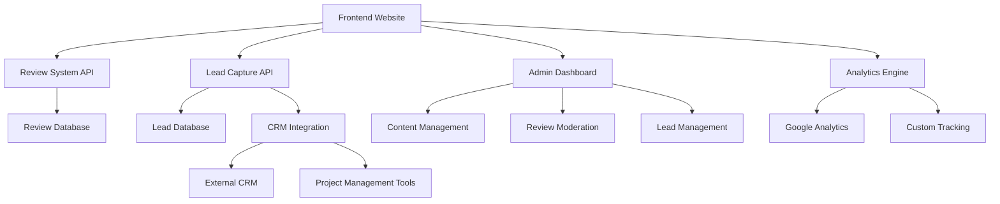

# Design Document: Website Refactoring for Startup-Focused Services

## Overview

This design document outlines the technical approach for refactoring the App Craft Services website to better serve startups and solo founders ready for investors/financiers. The refactoring will transform the current general web development positioning into a specialized service platform with real-time reviews, startup-focused content, and enhanced lead qualification systems.

## Architecture

### High-Level Architecture



### Technology Stack

- **Frontend**: HTML5, Tailwind CSS, JavaScript (existing)
- **Backend**: PHP (existing), enhanced with new APIs
- **Database**: JSON files (existing) + MySQL for reviews and leads
- **Real-time Updates**: WebSocket or Server-Sent Events for live reviews
- **Analytics**: Google Analytics + custom tracking
- **Integrations**: REST APIs for CRM and project management tools

## Components and Interfaces

### 1. Homepage Redesign Component

**Purpose**: Transform homepage messaging to target investment-ready startups

**Key Features**:
- Investment-focused hero messaging
- Startup terminology integration
- Funding stage-specific value propositions
- Real-time review display

**Interface**:
```javascript
class StartupHomepage {
  renderHeroSection(targetAudience: 'pre-seed' | 'series-a' | 'growth')
  displayRealtimeReviews(limit: number)
  showFundingMetrics(clientFunding: number[])
  renderStartupPackages()
}
```

### 2. Real-time Review System

**Purpose**: Display live customer testimonials with authenticity verification

**Key Features**:
- Live review updates
- Review moderation workflow
- Authenticity verification
- Star ratings and project details

**Interface**:
```javascript
class ReviewSystem {
  submitReview(reviewData: ReviewSubmission): Promise<ReviewResponse>
  moderateReview(reviewId: string, action: 'approve' | 'reject'): Promise<boolean>
  getRealtimeReviews(): WebSocket
  verifyReviewer(email: string, projectId: string): Promise<boolean>
}

interface ReviewSubmission {
  reviewerName: string
  company: string
  projectType: string
  rating: number
  content: string
  projectCompletionDate: Date
  contactPermission: boolean
}
```

### 3. Startup Service Packages Component

**Purpose**: Display funding stage-specific service offerings

**Key Features**:
- Pre-Seed MVP packages
- Series A Ready packages
- Investor Demo services
- Equity partnership options

**Interface**:
```javascript
class StartupPackages {
  getPackagesByStage(fundingStage: FundingStage): ServicePackage[]
  calculateEquityOptions(packageValue: number, startupValuation: number): EquityOption
  renderPackageComparison()
  showTimelineAlignment(fundingCycle: string)
}

enum FundingStage {
  PreSeed = 'pre-seed',
  SeedRound = 'seed',
  SeriesA = 'series-a',
  Growth = 'growth'
}
```

### 4. Portfolio Showcase Component

**Purpose**: Display detailed case studies of successful startup projects

**Key Features**:
- Detailed case studies with metrics
- Before/after business impact
- Technology stack information
- Client funding information

**Interface**:
```javascript
class PortfolioShowcase {
  getCaseStudies(minCount: number = 5): CaseStudy[]
  renderCaseStudy(caseStudy: CaseStudy): HTMLElement
  showBusinessImpact(metrics: BusinessMetrics): void
  displayTechStack(technologies: TechStack[]): void
}

interface CaseStudy {
  projectName: string
  clientName: string
  fundingRaised: number
  businessMetrics: BusinessMetrics
  techStack: TechStack[]
  timeline: ProjectTimeline
  testimonial: ClientTestimonial
}
```

### 5. Enhanced Lead Capture System

**Purpose**: Qualify and score leads based on startup readiness

**Key Features**:
- Startup-specific qualification questions
- Lead scoring algorithm
- Automatic routing based on qualification
- CRM integration

**Interface**:
```javascript
class LeadCaptureSystem {
  captureStartupLead(leadData: StartupLeadData): Promise<LeadResponse>
  scoreLead(leadData: StartupLeadData): LeadScore
  routeLead(lead: QualifiedLead): Promise<RoutingResult>
  integrateWithCRM(lead: QualifiedLead): Promise<CRMResponse>
}

interface StartupLeadData {
  contactInfo: ContactInfo
  fundingStage: FundingStage
  fundingTimeline: string
  targetInvestors: string[]
  projectUrgency: number
  budgetRange: string
  technicalRequirements: string[]
}

interface LeadScore {
  overallScore: number
  investmentReadiness: number
  projectUrgency: number
  budgetQualification: number
  timelineAlignment: number
}
```

### 6. Content Management Enhancement

**Purpose**: Manage startup-focused content and resources

**Key Features**:
- Investor-focused resource library
- Blog content management
- Downloadable templates
- SEO optimization for startup keywords

**Interface**:
```javascript
class StartupContentManager {
  createInvestorResource(resource: InvestorResource): Promise<boolean>
  manageBlogContent(content: BlogPost): Promise<boolean>
  generateDownloadableTemplate(templateType: TemplateType): Promise<string>
  optimizeForStartupSEO(content: string): string
}
```

## Data Models

### Review Data Model

```javascript
interface Review {
  id: string
  reviewerName: string
  company: string
  projectType: string
  rating: number
  content: string
  projectCompletionDate: Date
  submissionDate: Date
  moderationStatus: 'pending' | 'approved' | 'rejected'
  contactPermission: boolean
  verified: boolean
}
```

### Lead Data Model

```javascript
interface StartupLead {
  id: string
  contactInfo: ContactInfo
  companyInfo: CompanyInfo
  fundingInfo: FundingInfo
  projectInfo: ProjectInfo
  leadScore: LeadScore
  submissionDate: Date
  status: 'new' | 'qualified' | 'contacted' | 'converted'
}

interface FundingInfo {
  currentStage: FundingStage
  fundingTimeline: string
  targetInvestors: string[]
  previousFunding: number
  targetFunding: number
}
```

### Case Study Data Model

```javascript
interface CaseStudy {
  id: string
  projectName: string
  clientName: string
  industry: string
  fundingRaised: number
  businessMetrics: {
    userGrowth: string
    revenueGrowth: string
    marketExpansion: string
  }
  techStack: string[]
  projectTimeline: {
    startDate: Date
    launchDate: Date
    milestones: Milestone[]
  }
  testimonial: {
    content: string
    authorName: string
    authorTitle: string
    contactPermission: boolean
  }
}
```

## Correctness Properties

*A property is a characteristic or behavior that should hold true across all valid executions of a system-essentially, a formal statement about what the system should do. Properties serve as the bridge between human-readable specifications and machine-verifiable correctness guarantees.*

### Property Reflection

After reviewing the prework analysis, I identified several areas where properties can be consolidated:

- Multiple content display properties (1.3, 7.4, 4.2-4.6) can be combined into comprehensive content validation properties
- Review system properties (2.1, 2.3, 2.4) can be consolidated into a single review display property
- Analytics tracking properties (9.1-9.4) can be combined into a comprehensive tracking property
- Integration properties (10.1-10.4) can be consolidated into a single integration property

### Core Properties

**Property 1: Startup Terminology Integration**
*For any* page content, the system should include startup-specific terminology (MVP, product-market fit, scalability, investor pitch) when targeting startup audiences
**Validates: Requirements 1.3**

**Property 2: Real-time Review Updates**
*For any* new review submission, the system should update the homepage display within 60 seconds of approval
**Validates: Requirements 2.2**

**Property 3: Complete Review Information Display**
*For any* displayed review, the system should include reviewer name, company, project type, rating, and content
**Validates: Requirements 2.3, 2.4**

**Property 4: Email Notification Delivery**
*For any* completed project, the system should send review request emails to clients
**Validates: Requirements 2.7**

**Property 5: Service Package Funding Stage Alignment**
*For any* service package display, packages should be clearly labeled with appropriate funding stages
**Validates: Requirements 3.5**

**Property 6: Minimum Case Study Count**
*For any* portfolio showcase page load, the system should display at least 5 detailed case studies
**Validates: Requirements 4.1**

**Property 7: Complete Case Study Information**
*For any* case study, the system should display business metrics, technology stack, timeline, and client testimonial information
**Validates: Requirements 4.2, 4.3, 4.4, 4.5, 4.6**

**Property 8: Startup Lead Qualification Fields**
*For any* lead capture form, the system should include fields for funding stage, timeline, and investor information
**Validates: Requirements 5.1, 5.2, 5.3**

**Property 9: Lead Scoring Calculation**
*For any* submitted lead, the system should calculate scores based on investment readiness and project urgency
**Validates: Requirements 5.4**

**Property 10: Qualified Lead Routing**
*For any* lead with high qualification scores, the system should route to priority response queue
**Validates: Requirements 5.5**

**Property 11: Mobile Performance Standards**
*For any* page on mobile devices, the system should load within 3 seconds
**Validates: Requirements 8.2**

**Property 12: Comprehensive Analytics Tracking**
*For any* user interaction with startup-focused content, the system should track conversion rates, engagement, and funnel progression
**Validates: Requirements 9.1, 9.2, 9.3, 9.4**

**Property 13: CRM and Integration Synchronization**
*For any* qualified lead or client project, the system should automatically sync data with CRM and project management systems
**Validates: Requirements 10.1, 10.2, 10.3, 10.4**

## Error Handling

### Review System Error Handling

- **Invalid Review Submissions**: Validate all required fields before processing
- **Moderation Failures**: Implement retry logic for review approval/rejection
- **Real-time Update Failures**: Graceful degradation to periodic refresh if WebSocket fails

### Lead Capture Error Handling

- **Form Validation Errors**: Client-side and server-side validation with clear error messages
- **Scoring Algorithm Failures**: Default to manual review if automated scoring fails
- **CRM Integration Failures**: Queue leads for retry and notify administrators

### Performance Error Handling

- **Slow Loading**: Implement progressive loading for heavy content
- **Mobile Performance Issues**: Optimize images and implement lazy loading
- **Analytics Failures**: Ensure core functionality works even if tracking fails

## Testing Strategy

### Dual Testing Approach

The testing strategy combines unit tests for specific functionality with property-based tests for comprehensive coverage:

**Unit Tests**:
- Specific examples of startup messaging display
- Individual review submission and moderation workflows
- Lead scoring algorithm with known inputs
- CRM integration with mock data
- Mobile form submission functionality

**Property-Based Tests**:
- Universal properties across all content types and user interactions
- Comprehensive input coverage through randomization
- Performance testing across different device types and network conditions
- Integration testing with various CRM and project management systems

**Property Test Configuration**:
- Minimum 100 iterations per property test
- Each property test references its design document property
- Tag format: **Feature: website-refactoring, Property {number}: {property_text}**

**Testing Framework**: Jest for JavaScript unit tests, PHPUnit for PHP backend tests, Cypress for end-to-end testing

### Performance Testing

- **Load Testing**: Simulate high traffic during startup funding announcements
- **Mobile Performance**: Test on various devices and network conditions
- **Real-time Updates**: Stress test review system with concurrent submissions

### Integration Testing

- **CRM Integration**: Test with multiple CRM systems (HubSpot, Salesforce, Pipedrive)
- **Analytics Integration**: Verify Google Analytics and custom tracking accuracy
- **Email Systems**: Test review request and notification delivery

### Security Testing

- **Form Validation**: Test against injection attacks and malformed data
- **Review Authenticity**: Verify reviewer verification system effectiveness
- **Admin Access**: Test admin dashboard security and access controls