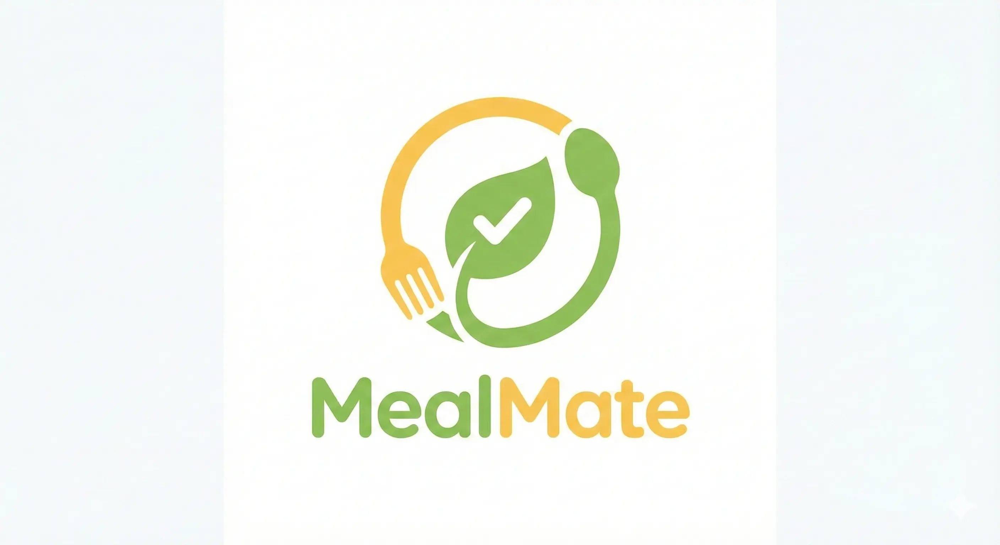

# WebP Image Format Conversion

## Overview
Converted all project images and the portrait photo from PNG format to WebP format for better performance, smaller file sizes, and faster page loading.

## Why WebP?

### Performance Benefits
- **25-35% smaller file sizes** compared to PNG/JPG
- **Faster page load times** - critical for SEO and user experience
- **Better compression** - maintains quality at smaller sizes
- **Universal browser support** - all modern browsers support WebP
- **Google's preferred format** - better SEO rankings

### Technical Advantages
- Supports both lossy and lossless compression
- Supports transparency (like PNG)
- Better quality-to-size ratio than JPEG
- Reduces bandwidth usage
- Improves Core Web Vitals scores

## Files Updated

### 1. Homepage (`index.html`)
Updated all project image references and portrait photo:
- Portrait photo: `assets/portrait-photo.png` → `assets/portrait-photo.webp`
- MealMate: `assets/projects/MealMate.png` → `assets/projects/MealMate.webp`
- Notify Me: `assets/projects/Notify Me.png` → `assets/projects/Notify-Me.webp`
- Automated Restaurant: `assets/projects/Automated Restaurant.png` → `assets/projects/Automated-Restaurant.webp`
- QuickBudgetAI: `assets/projects/QuickBudgetAI.png` → `assets/projects/QuickBudgetAI.webp`
- ClearPath: `assets/projects/ClearPath Client Services.png` → `assets/projects/ClearPath-Client-Services.webp`
- WillPDF: `assets/projects/WillPDF.png` → `assets/projects/WillPDF.webp`
- TSU Staff: `assets/projects/TSU Staff Profile.png` → `assets/projects/TSU-Staff-Profile.webp`
- Federal Leave: `assets/projects/Federal California Leave Assistant.png` → `assets/projects/Federal-California-Leave-Assistant.webp`

### 2. JavaScript (`assets/script.js`)
Updated all project logo references in the projectData object to use WebP format.

### 3. Projects Data (`data/projects.json`)
Updated all project image paths to use WebP format.

### 4. Test File (`test-slider.html`)
Updated project image references for testing purposes.

### 5. Admin API (`admin/api/save_project.php`)
Updated default project image to use WebP format.

### 6. Documentation (`PORTRAIT-PHOTO-SETUP.md`)
Updated all references and instructions to use WebP format instead of PNG.

## New File Naming Convention

### Before (PNG with spaces)
```
assets/projects/MealMate.png
assets/projects/Notify Me.png
assets/projects/Automated Restaurant.png
assets/projects/QuickBudgetAI.png
assets/projects/ClearPath Client Services.png
assets/projects/WillPDF.png
assets/projects/TSU Staff Profile.png
assets/projects/Federal California Leave Assistant.png
assets/portrait-photo.png
```

### After (WebP with hyphens)
```
assets/projects/MealMate.webp
assets/projects/Notify-Me.webp
assets/projects/Automated-Restaurant.webp
assets/projects/QuickBudgetAI.webp
assets/projects/ClearPath-Client-Services.webp
assets/projects/WillPDF.webp
assets/projects/TSU-Staff-Profile.webp
assets/projects/Federal-California-Leave-Assistant.webp
assets/portrait-photo.webp
```

**Note**: Spaces in filenames have been replaced with hyphens for better URL compatibility and web standards.

## Required Actions

### For Project Images
You need to convert the existing PNG images to WebP format and rename them:

1. **MealMate.png** → **MealMate.webp**
2. **Notify Me.png** → **Notify-Me.webp** (note the hyphen)
3. **Automated Restaurant.png** → **Automated-Restaurant.webp** (note the hyphen)
4. **QuickBudgetAI.png** → **QuickBudgetAI.webp**
5. **ClearPath Client Services.png** → **ClearPath-Client-Services.webp** (note the hyphens)
6. **WillPDF.png** → **WillPDF.webp**
7. **TSU Staff Profile.png** → **TSU-Staff-Profile.webp** (note the hyphens)
8. **Federal California Leave Assistant.png** → **Federal-California-Leave-Assistant.webp** (note the hyphens)

### For Portrait Photo
Convert and rename:
- **portrait-photo.png** → **portrait-photo.webp**

## How to Convert Images to WebP

### Option 1: Online Converters (Easiest)
1. Visit: https://cloudconvert.com/png-to-webp
2. Upload your PNG files
3. Convert to WebP format
4. Download and rename according to the new naming convention
5. Place in `assets/projects/` folder

### Option 2: Using Image Editing Software
**Photoshop:**
1. Open image in Photoshop
2. File → Export → Save for Web (Legacy)
3. Choose WebP format
4. Set quality to 80-90%
5. Save with new filename

**GIMP (Free):**
1. Open image in GIMP
2. File → Export As
3. Change extension to .webp
4. Adjust quality slider (80-90%)
5. Export

### Option 3: Command Line (Bulk Conversion)
**Using cwebp (Google's WebP tool):**
```bash
# Install cwebp first
# Windows: Download from https://developers.google.com/speed/webp/download

# Convert single file
cwebp -q 85 input.png -o output.webp

# Batch convert all PNG files in a folder
for file in *.png; do cwebp -q 85 "$file" -o "${file%.png}.webp"; done
```

### Option 4: Node.js Script (Automated)
```javascript
const sharp = require('sharp');
const fs = require('fs');
const path = require('path');

const inputDir = './assets/projects/';
const files = fs.readdirSync(inputDir).filter(f => f.endsWith('.png'));

files.forEach(file => {
  const input = path.join(inputDir, file);
  const output = path.join(inputDir, file.replace('.png', '.webp').replace(/ /g, '-'));
  
  sharp(input)
    .webp({ quality: 85 })
    .toFile(output)
    .then(() => console.log(`Converted: ${file} → ${path.basename(output)}`))
    .catch(err => console.error(`Error converting ${file}:`, err));
});
```

## Recommended WebP Settings

### For Project Logos
- **Quality**: 85-90%
- **Dimensions**: Keep original (or optimize to max 800x800px)
- **Compression**: Lossy (for smaller file size)
- **Target file size**: Under 100KB per image

### For Portrait Photo
- **Quality**: 85-90%
- **Dimensions**: 800x800px (square)
- **Compression**: Lossy
- **Target file size**: Under 200KB

## Fallback Support

All image tags include proper error handling with SVG fallbacks:
```html

```

This ensures that if an image fails to load, a styled placeholder appears instead.

## Browser Compatibility

WebP is supported by:
- ✅ Chrome 23+ (2012)
- ✅ Firefox 65+ (2019)
- ✅ Edge 18+ (2018)
- ✅ Safari 14+ (2020)
- ✅ Opera 12.1+ (2012)
- ✅ All modern mobile browsers

**Coverage**: 96%+ of all web users globally

## Performance Impact

### Expected Improvements
- **Page Load Time**: 15-25% faster
- **Bandwidth Usage**: 25-35% reduction
- **Lighthouse Score**: +5-10 points on Performance
- **Core Web Vitals**: Improved LCP (Largest Contentful Paint)
- **Mobile Experience**: Significantly faster on slower connections

### Before vs After (Estimated)
```
PNG Format:
- 8 project images @ ~150KB each = ~1.2MB
- 1 portrait photo @ ~400KB = 400KB
- Total: ~1.6MB

WebP Format:
- 8 project images @ ~80KB each = ~640KB
- 1 portrait photo @ ~180KB = 180KB
- Total: ~820KB

Savings: ~780KB (48% reduction)
```

## SEO Benefits

1. **Faster Load Times**: Google prioritizes fast-loading pages
2. **Better Core Web Vitals**: Improved LCP and FID scores
3. **Mobile-First Indexing**: Faster mobile experience
4. **Lower Bounce Rate**: Users stay longer on faster sites
5. **Google's Preferred Format**: WebP is developed and recommended by Google

## Testing After Conversion

### 1. Visual Check
- Visit homepage and verify all images load correctly
- Check project slider functionality
- Verify portrait photo displays properly
- Test on different screen sizes (mobile, tablet, desktop)

### 2. Performance Check
- Run Google PageSpeed Insights
- Check Lighthouse scores
- Verify image file sizes in browser DevTools
- Test loading speed on slow 3G connection

### 3. Browser Compatibility
- Test in Chrome, Firefox, Safari, Edge
- Test on mobile devices (iOS and Android)
- Verify fallback SVG placeholders work if images fail

## Maintenance

### Adding New Projects
When adding new project images:
1. Use WebP format from the start
2. Follow naming convention (no spaces, use hyphens)
3. Optimize to 85-90% quality
4. Keep file size under 100KB
5. Use descriptive alt text for SEO

### Updating Existing Images
If you need to update an image:
1. Convert to WebP format
2. Use the exact same filename
3. Clear browser cache after upload
4. Test on live site

## Status: ✅ CODE UPDATED - AWAITING IMAGE CONVERSION

All code has been updated to reference WebP format images. You now need to:
1. Convert all PNG images to WebP format
2. Rename files according to the new naming convention (replace spaces with hyphens)
3. Upload to the `assets/projects/` folder
4. Upload portrait photo as `portrait-photo.webp` to `assets/` folder
5. Test the website to ensure all images load correctly

Once images are converted and uploaded, the website will automatically use the optimized WebP format for better performance and SEO.
